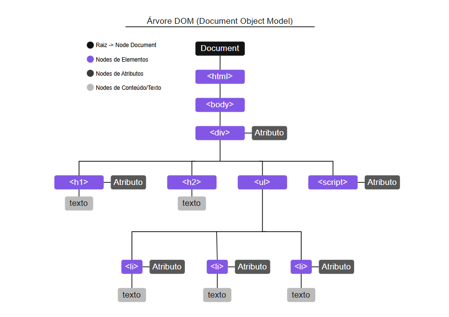

# 🟡 Primeira aula sobre JavaScript

> *Aviso breve:*
Como esta aula abordou diversos assuntos, ela acabou não tendo um foco tão definido como as anteriores.

## 💡 O que é JavaScript?

De forma resumida, JavaScript é uma linguagem de programação capaz de rodar tanto em navegadores quanto em servidores, através do Node.js.

No front-end, seu uso é voltado principalmente para interação com o usuário e manipulação de elementos HTML, como animações, utilidades, efeitos etc.

Também é muito utilizada para criar conexões com servidores via APIs, permitindo o uso de dados externos.

Um exemplo prático é o YouTube, que conecta o site à sua conta e exibe vídeos da biblioteca da plataforma.

---

## 🌳 Árvore DOM

A Árvore DOM (Document Object Model) representa a estrutura HTML como uma árvore, onde cada elemento é um **nó** (`Node`). Quanto mais conteúdo, mais ramificações existirão, como no exemplo abaixo:



Nesse exemplo, temos uma página simples, onde os elementos são as tags com seus atributos e conteúdos.

---

### ❓ Para que serve?

- Mostra o mapa interno que o navegador cria da página (elementos HTML em hierarquia).
- Permite que o JavaScript altere conteúdo/estilos dinamicamente.
- Garante interatividade (cliques, formulários etc.).
- É a ponte entre HTML, CSS e JavaScript.

---

## 🏷️ Seletores

Seletores são usados para selecionar elementos HTML e manipular seus estilos, conteúdos etc.<br>
Existem três tipos principais de seletores:

- **Tags do HTML** &rarr; Usamos o nome da tag, por exemplo: `p` para parágrafos.
- **Classes CSS** &rarr; Usamos o nome da classe atribuída aos elementos.
- **Identificadores (ID)** &rarr; Usamos o id atribuído ao elemento.

---

### 📋 Exemplos

```css
p { color: red;} /* Aplica o estilo a todas as tags <p>. */

.negrito { font-weight: bold;} /* Aplica o estilo a todos os elementos com class="negrito". */

#principal { color: green;} /* Aplica o estilo ao elemento com id="principal". */
```

Esses seletores permitem modificar elementos específicos, seja todos, alguns ou apenas um.

#### Outros exemplos

```css
a:hover { color: red;} /* Estiliza o elemento quando o cursor está sobre ele. */

h1, h2, h3 { color: red;} /* Formata várias tags ao mesmo tempo. */

#c1 p a { color: red;} /* Formata uma tag <a> dentro de <p> dentro do elemento com id="c1". */

.dark:first-child { color: red;} /* Formata o primeiro filho de um elemento com class="dark". */

p::after { content: 'Obrigado!'; } /* Adiciona conteúdo após o elemento <p>. */
```

---

## 🖱️ Acesso aos elementos via JavaScript

### Principais métodos de seleção

- `getElementsByTagName('')` &rarr; Seleciona elementos pelo nome da tag.
- `getElementById('')` &rarr; Seleciona elemento pelo id.
- `getElementsByClassName('')` &rarr; Seleciona elementos pela classe.
- `getElementsByName('')` &rarr; Seleciona elementos pelo atributo name.

---

### 📝 Exemplo de seleção de elementos

```js
let p1 = document.getElementById('p1'); // Seleciona o elemento com id="p1" e armazena na variável p1.

p1.innerHTML = '<p>Olá Mundo!!!</p>'; // Atualiza o conteúdo do elemento.
```

Esse código é útil para fazer alterações rápidas em elementos HTML.

---

## 🧩 Funções

Funções são blocos de código que executam uma tarefa específica. Elas podem ou não receber parâmetros e retornar valores.

Sempre que uma função é chamada, todo o código dentro dela é executado.

### Exemplo de função em JavaScript

```js
function minhaFuncao(n1, n2) {
    let soma = n1 + n2;
    console.log(soma);
}

minhaFuncao(1, 2);
```

> Neste exemplo, a função recebe dois valores e exibe a soma deles no console.

---

### 🛠️ Formas de criar funções

Atualmente, existem duas formas principais de criar funções em JavaScript:

#### Formato tradicional

```js
function soma(n1, n2) { // Declara a função com dois parâmetros
    let n3 = n1 + n2; // Soma os parâmetros
    alert(`A soma dos números é igual a: ${n3}`); // Exibe o resultado
}
```

#### Arrow Function

```js
const soma = (n1, n2) => { // Função que recebe dois parâmetros
    let n3 = n1 + n2; // Soma os parâmetros
    alert(`A soma dos números é igual a: ${n3}`); // Exibe o resultado
}
```

*Comentário:* Use crase (\`) para interpolação de variáveis em strings (template literals), não aspas simples.

---

## 🖥️ Interatividade no HTML

Com JavaScript, é possível criar diversas interatividades no HTML, como:

- Componentes de entrada e caixas de diálogo
- Utilização de eventos
- Resposta a eventos com funções em JS
- Associação dinâmica, como ocorre no jQuery

```javascript
$("#cmd1").on("click", (event) => { 
    hiddenBox.show();
});
```

*Comentário:* O exemplo acima utiliza jQuery para mostrar um elemento ao clicar em outro.

---

## 🗂️ Alguns eventos do HTML

| Comando      | Evento                        |
|:------------:|:----------------------------:|
| `onLoad`     | Carregamento da página        |
| `onClick`    | Quando um elemento é clicado  |
| `onDblClick` | Quando um elemento é clicado duas vezes |
| `onSubmit`   | Quando um formulário é enviado|
| `onChange`   | Alteração de um elemento      |
| `onBlur`     | Quando perde o foco           |
| `onFocus`    | Quando recebe foco            |
| `onKeyPress` | Quando uma tecla é pressionada|
| `onMouseOver`| Quando o mouse está sobre o elemento |
| `onMouseOut` | Quando o mouse sai do elemento|

---

## 🛠️ Interação e modificação via JS

```html
<html>
    <body>
        <div id="d1">Conteúdo Original</div>
        <button onClick="alterar()">Clique Aqui</button>
        
        <script>
            const alterar = () => {
                let d1 = document.getElementById('d1');
                d1.innerHTML = "Conteúdo Alterado";
                d1.style.backgroundColor = "yellow";
            }
        </script>
    </body>
</html>
```

---

Nesse exemplo, mostramos uma estrutura simples de `HTML` e `JS`, na qual, a partir de comandos em JS, alteramos o conteúdo e a cor de um elemento HTML com a chamada da função `alterar()` ao clicar no botão.

> Uma demonstração desse site pode ser encontrada na pasta de exemplos no Anexo da aula!

---

## ✅ Conclusão

Nesta aula extensa, abordamos diversos tópicos de JavaScript, como:

- O que é JavaScript?
- Árvore DOM
- Seletores
- Acesso aos elementos via JavaScript
- Funções
- Interatividade no HTML
- Alguns eventos do HTML
- Interação e modificação via JS

Agora é hora de colocar em prática o que vimos, explorar mais um pouco e se preparar para a próxima aula!

---
