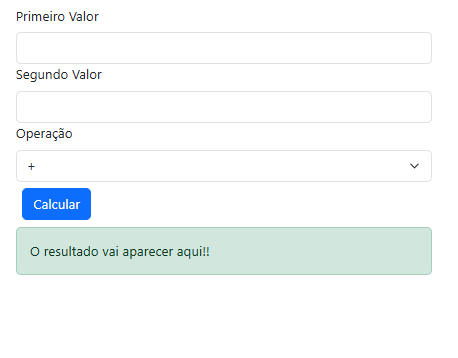

# 📝 JavaScript na Prática

Hoje nós vamos criar um projeto de calculadora simples, usando HTML, JS e o framework CSS Bootstrap.

---

### 🖼️ Resultado

---



---

## 🛠️ Passos

1- O primeiro passo desse projeto é conectá-lo com o framework do Bootstrap, já que o foco aqui é JS e sua interação com HTML, e não o CSS.

---
```html
<!DOCTYPE html>
<html>
    <head>
        <title>Calculadora</title>
        <link href="https://cdn.jsdelivr.net/npm/bootstrap@5.3.8/dist/css/bootstrap.min.css" rel="stylesheet" integrity="sha384-sRIl4kxILFvY47J16cr9ZwB07vP4J8+LH7qKQnuqkuIAvNWLzeN8tE5YBujZqJLB" crossorigin="anonymous">
    </head>
</html>
```
---

2- Vamos adicionar a estrutura do body e colocar os elementos que usamos:

- Um `<form>` com duas `<label>` e seus `<input type="number">`
- Vamos também adicionar um `<button>` para clicarmos quando quisermos executar a calculadora.
- E uma `<div>` para exibir o resultado nela.
- Lembre-se de colocar os identificadores nas tags para conseguirmos linkar com o nosso script e chamá-los no JS.

> As classes de estilização estão no próprio código. Se você quiser saber mais sobre elas, recomendo que dê uma olhada no conteúdo do [Bootstrap](https://getbootstrap.com/docs/5.3/forms/form-control/)

---

### 🏗️ Como ficou

---

```html
[...]
<body class="container">
    <!-- Formulário da calculadora -->
    <form class="form m-2">
        <!-- Campo para o primeiro valor -->
        <label class="form-label" for="v1">Primeiro Valor</label>
        <input class="form-control" type="number" id="v1">

        <!-- Campo para o segundo valor -->
        <label class="form-label" for="v2">Segundo Valor</label>
        <input class="form-control" type="number" id="v2">

        <!-- Seleção da operação -->
        <label class="form-label" for="oper">Operação</label>
        <select class="form-select" id="oper">
            <option value="+">+</option>
            <option value="-">-</option>
            <option value="*">*</option>
            <option value="/">/</option>
            <option value="^">^</option>
        </select>

        <!-- Botão para calcular -->
        <button type="button" class="btn btn-primary m-2" onclick="calcular()">Calcular</button>

        <!-- Área para exibir o resultado -->
        <div class="alert alert-success" id="d1">O resultado vai aparecer aqui!!</div>
    </form>
</body>    
```

---

3- Criando o script para calcular os valores.

Nessa parte, vamos primeiro criar a função que é chamada pelo botão. Ela vai pegar os valores dos campos e executar a operação conforme o que foi escolhido.

- Dentro dela, pegamos os valores e definimos como números, depois criamos uma série de funções para calcular os valores.
- Depois usamos um switch para pegar o valor detectado e executar a função correspondente.
- Logo depois, exibimos o resultado na tela.

---

### 💻 Como ficou

---

```html
<script>
        // Função principal de cálculo
        const calcular = () => {
            // Obtendo valores dos campos
            const v1 = Number(document.getElementById("v1").value);
            const v2 = Number(document.getElementById("v2").value);
            const oper = document.getElementById("oper").value;

            // Funções para cada operação
            const somar = (a, b) => a + b;
            const subtrair = (a, b) => a - b;
            const multiplicar = (a, b) => a * b;
            const dividir = (a, b) => a / b;
            const potencia = (a, b) => Math.pow(a, b);

            let res = 0;

            // Seleciona a operação conforme o valor escolhido
            switch (oper) {
                case "+": res = somar(v1, v2); break;
                case "-": res = subtrair(v1, v2); break;
                case "*": res = multiplicar(v1, v2); break;
                case "/": res = dividir(v1, v2); break;
                case "^": res = potencia(v1, v2); break;
                default: res = "Operação inválida";
            }

            // Exibe o resultado na tela
            document.getElementById("d1").innerHTML = `O resultado da conta é: ${res}`;
        }
    </script>
```

---

## ✅ Conclusão

Bom, essa aula é praticamente isso. É uma calculadora simples, mas muito útil para entendermos alguns conceitos. Se você quiser ver como fica o resultado de todos esses códigos, basta ir para a pasta de exemplos no anexo da aula e estudar o `.html` da aula, tudo vai estar lá certinho!

Bons estudos, e sempre coloque tudo o que você aprendeu em prática!

---
