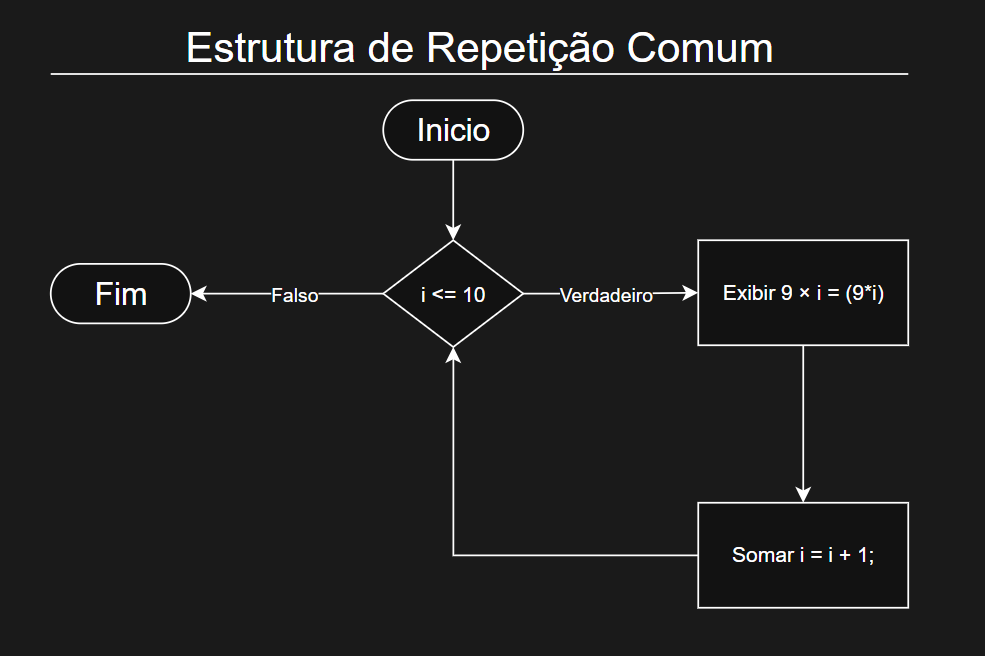
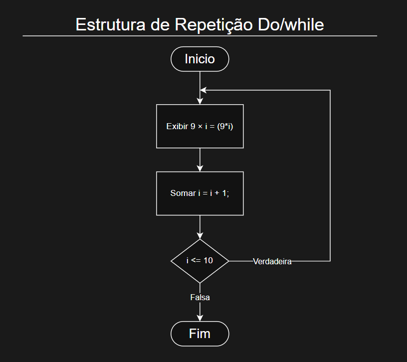

# Estruturas de Repetição

## O que são?

 - As estruturas de repetição são usadas para executar um conjunto de instruções repetidas vezes. Sendo útil para diversas tarefas e deixando o código mais organizado.<br>Existem diversos exemplos de útilidade de estruturas de repetição, mas nosso foco hoje vai ser como elas funcionam.

## Como funcionam?

 - As estruturas de condição são como if/else, mas com um pouco de mais de complexidade. Onde essas estruturas executam os comandos repetidas vezes enquanto a condição for verdadeira, e deixam de executar quando a condição se torna falsa. 

 - Essa explicação não se aplica a todas as estruturas como vamos ver a seguir, mas as estruturas de repetição geralmente funcionam da mesma maneira.




## Comando While - Estrutura Enquanto / Faça

 - Essa estrutura `while` se encaixa perfeitamente na explicação anterior, onde o código dentro dela vai ser executado diversas vezes enquanto a condição for verdadeira.

```js
let x = 1; // Declarando a variável
while (x <= 10){ // Checando se x é menor ou igual a 10 dentro do while
    console.log(x); // Imprimindo o valor de x
    x++; // Incrementando o valor de x (igual a x = x + 1)
}
```

 - Esse é um jeito bem simples de se colocar um loop em um código.

> É importante que dentro do while haja um incremento que modifique o valor da condição para que se torne falsa, se não ele vai ficar em um loop infinito e vai travar o navegador.

