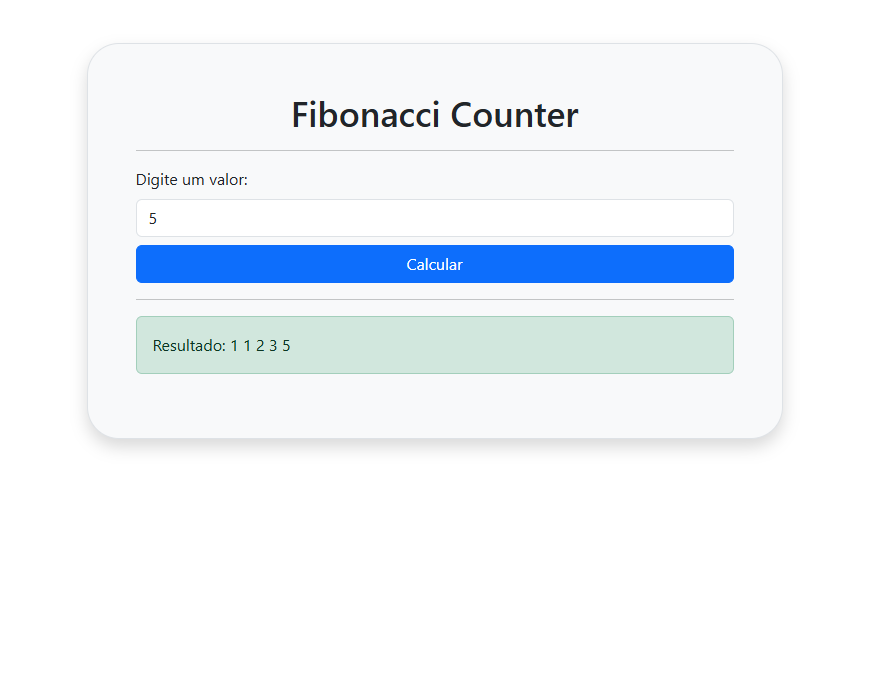

# 🔄 Estruturas de Repetição na Prática

## 🧮 Série de Fibonacci

O objetivo de hoje é desenvolver um site simples que recebe um valor `x` e retorna a sequência de Fibonacci com `x` elementos.

Para isso, vamos utilizar novamente o framework CSS Bootstrap, assim focamos apenas no JavaScript e no HTML.

---

## 💻 Códigos

### 📝 HTML

---

```html
<body class="container">

    <div class="mt-5 border p-5 bg-light shadow rounded-5">

        <h1 class="text-center">Fibonacci Counter</h1>

        <hr>

        <label for="id_fibonacci" class="form-label">Digite um valor:</label>
        <input type="number" id="v1" class="form-control">

        <button onclick="calcular()" class="btn btn-primary mt-2 w-100">Calcular</button>

        <hr>

        <div class="alert alert-success" id="res">Resultado: </div>

    </div>

</body>
```

> Neste exemplo, o framework Bootstrap já está integrado.

---

### 📂 JavaScript Externo

---

```javascript
const fibonacci = (x) => { // Cria uma função fibonacci que recebe um valor
    let fm1 = 1, fm2 = 1, fm; // Declara 3 variáveis
    
    if (x === 0 || x === 1) { // Se x for 0 ou 1
        return 1; // Retorna 1
    } else { // Se x for diferente de 0 ou 1

        for (let i = 2; i <= x; i++) { // Loop que se repete enquanto i for menor ou igual a x 
            fm = fm1 + fm2; // fm recebe fm1 + fm2
            fm1 = fm2; // fm1 recebe fm2
            fm2 = fm; // fm2 recebe fm
        
            // Os valores vão se alterando conforme a sequência de Fibonacci
        }
        return fm; // Retorna o valor de fm
    }
}
```
<div align="center">

|f1|f2|fm|
|:-:|:-:|:-:|
|1|1|2|
|1|2|3|
|2|3|5|
|3|5|8|

</div>

> Esta tabela demonstra como os valores se comportam ao longo da repetição.

---

#### 🗒️ Legenda

- `fm1`: Valor anterior ao último na sequência.
- `fm2`: Último valor calculado.
- `fm`: Novo valor da sequência, soma dos dois anteriores.

---

### 🖥️ JavaScript Interno

---

```html
<script>

    // Função chamada ao clicar no botão
    const calcular = () => {

        // Pega o valor digitado e converte para número
        let x = Number(document.getElementById("v1").value) - 1; // Obtém o valor do input e subtrai 1

        let limite = x; // Guarda o valor original para usar como limite
        x = 0; // Inicializa x como 0

        // Limpa o resultado antes de calcular
        document.getElementById("res").innerHTML = "Resultado: "; // Limpa o conteúdo anterior

        // Calcula e mostra cada termo de Fibonacci até o valor digitado
        while (x <= limite) { // Enquanto x for menor ou igual ao limite
            document.getElementById("res").innerHTML += `${fibonacci(x)} `; // Adiciona o termo de Fibonacci ao resultado
            x++; // Incrementa x
        }
    }

</script>
```

---

## 🖼️ Resultado



---

## 📚 Conclusão

Nesta aula, colocamos em prática o estudo sobre estruturas de repetição. Usando os loops `for` e `while`, vimos suas diferenças e utilidades.

Bom, é isso! Espero que tenham gostado. Lembrem-se sempre de praticar e até a próxima!

---