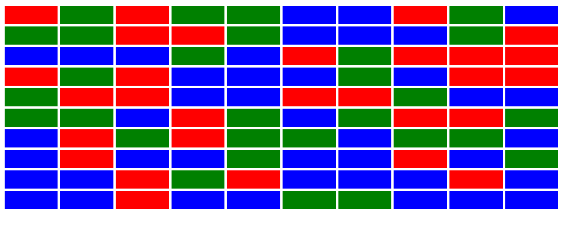
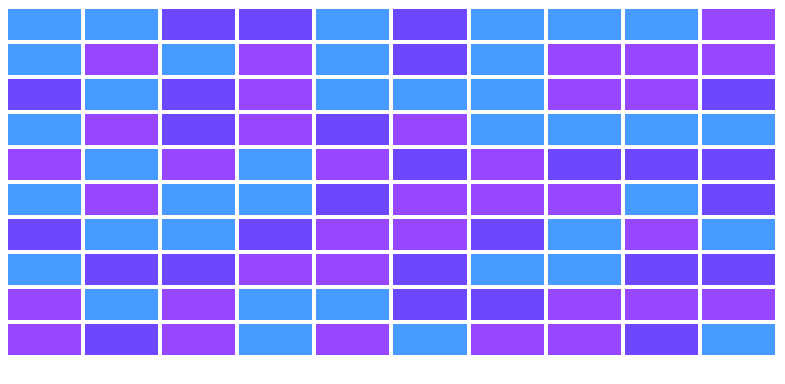

# 🎲 Exemplo com randômicos

Para "aleatorizar" os dados, podemos utilizar o `Math.random()`, que retorna um valor aleatório.

---

```html
<table style="width: 100%;"> <!-- Cria uma tabela -->

<script>
    const cores = ["red", "green", "blue"]; // Cria um vetor que armazena os dados das cores

    for (let i = 0; i < 10; i++) { // Cria um loop que será executado 10 vezes
        document.write("<tr>"); // Cria uma linha na tabela

        for (let j = 0; j < 10; j++) { // Cria um loop que será executado 10 vezes
            let pos = Math.trunc(Math.random() * 3); // Retorna um número aleatório entre 0 e 2 e armazena na variável pos
            document.write(`<td style="background-color: ${cores[pos]};">&nbsp;</td>`); // Escreve um dado na tabela e define a cor de fundo através do vetor de cores com o valor aleatório do pos como índice
        }

        document.write("</tr>"); // Fecha a linha
    }
</script>
```

---

- `Math.trunc()` - Retorna um valor inteiro sem casas decimais.
- `Math.random() * 3` - Retorna um valor aleatório menor que 3 (0, 1 ou 2).

---

Como explicado no código acima, ele vai criar uma tabela de 10x10 com cores aleatórias entre vermelho, verde e azul (os valores do vetor "cores[]").

---

## 🖼️ Resultado:



---

## 🎨 Melhorando o visual

Como eu não gostei muito dessas cores, resolvi fazer uma alteração, trocando o padrão de nomes de cores para valores RGB.<br>
Também alterei os valores do vetor "cores[]" para valores RGB.

---

```html
<table cellspacing="5" cellpadding="9" style="width: 100%; height: 50%;">

<script>
    const cores = ["71, 154, 255", "108, 71, 255", "151, 71, 255"];
    for (let i = 0; i < 10; i++) {
        document.write("<tr>");
        for (let j = 0; j < 10; j++) {
            let pos = Math.trunc(Math.random() * 3);
            document.write(`<td style="background-color: rgb(${cores[pos]});">&nbsp;</td>`);
        }
        document.write("</tr>");
    }
</script>
```
---

## 🖼️ Resultado:



---

## 📝 Conclusão

Nesta aula, aprendemos como usar os comandos `Math.random()` e `Math.trunc()` para gerar dados aleatórios, e como eles podem ser usados para criar tabelas com cores aleatórias.

Além disso, vimos uma forma interessante de usar loops para criar tabelas de maneira mais rápida.

> Lembrando que essa anotação tem um exemplo na pasta, só ver o anexo dessa aula!!
---
