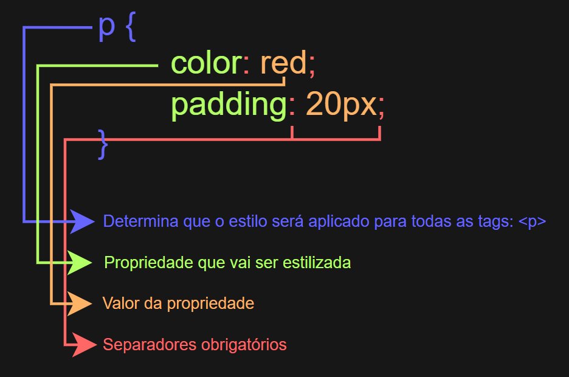
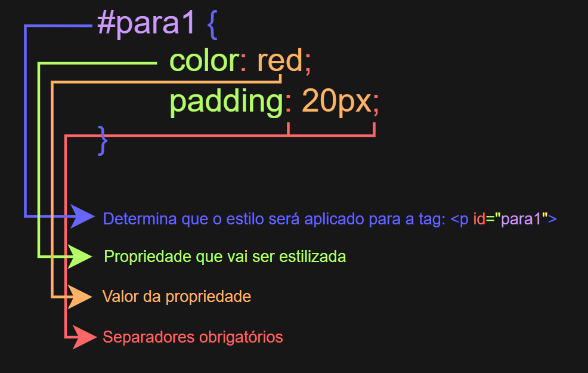
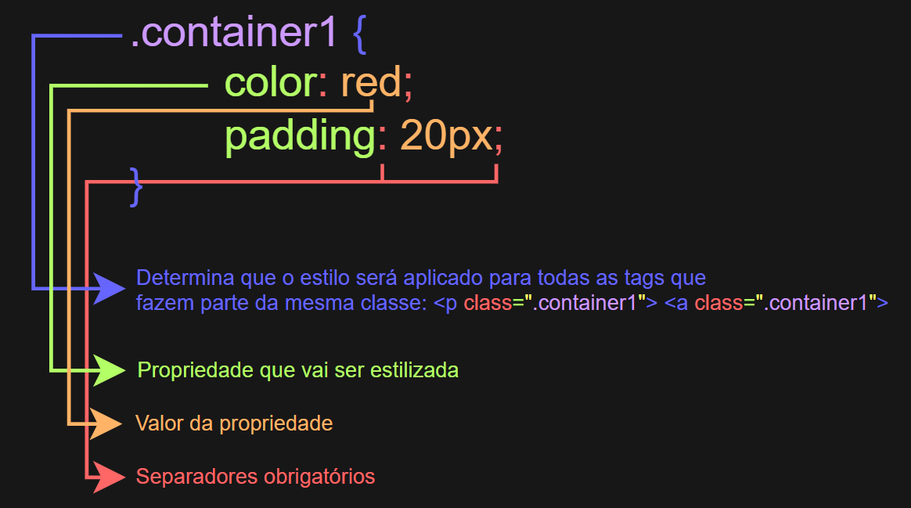

# 🎨 Utilizando CSS em página HTML

## ℹ️ Sobre

- CSS (Cascading Style Sheets) é uma linguagem de estilo utilizada para estilizar elementos HTML.
- Ela permite definir cores, tamanhos, fontes e outros aspectos visuais dos elementos da página.

## 🛠️ Uso

- O CSS pode ser aplicado de três formas diferentes no HTML:

    - **Inline:** Definindo o estilo diretamente na tag HTML.<br>
    *(É o menos recomendado, pois fica muito difícil de administrar e deixa o código mais poluído.)*
    ```html
    <p style="color: red;">Exemplo</p>
    ```

    - **Interno:** Definindo o estilo dentro da tag `<style>`.<br>
    *(Melhor que o método inline, mas também não é muito recomendado.)*
    ```html
    <style> p { color: red; } </style>
    ```

    - **Externo:** Definindo o estilo em um arquivo separado, com extensão `.css`.<br>
    *(É o mais utilizado e o mais recomendado, pois permite uma melhor organização dos códigos e dos arquivos.)*
    ```html
    <link rel="stylesheet" href="estilo.css">
    ```

## 🏷️ Declaração por seletores

- O CSS pode ser declarado por um ou mais seletores, que especificam quais elementos do HTML devem ser estilizados.
- Uma declaração de CSS geralmente consiste em um seletor e uma propriedade de estilo, separados por dois pontos (`:`).

### 📝 Exemplos de Declarações

---

#### ✅ Declaração por tags

---

- Ela é usada quando você quer alterar o estilo de diversas tags HTML de uma vez.



---

#### 🆔 Declaração por ID

---

- Ela é usada quando você quer alterar o estilo de uma tag HTML específica.



---

#### 🏷️ Declaração por Classe

---

- Ela é usada quando você quer alterar o estilo de uma ou mais tags HTML que pertencem a uma mesma classe.



---

## 📁 Exemplos

- O exemplo desta aula pode ser encontrado na pasta de exemplos (Anexo-aula006).
    - Lá estão três arquivos HTML: um com estilo inline, outro com estilo interno e o terceiro com estilo externo.
    - Assim, é possível visualizar o uso de cada um desses exemplos de forma mais clara em uma página HTML.
    - Nos exemplos, eu não apliquei as declarações por ID e por Classe, pois foquei mais em como aplicar o estilo de cada forma.

---
