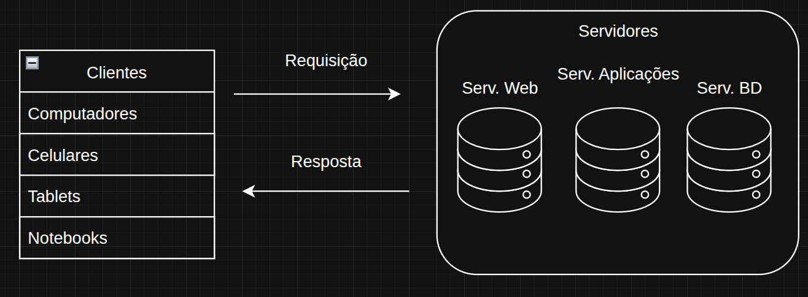

# 🤝 Modelo: Cliente x Servidor

## 📝 Características

- &rarr; Há uma separação de tarefas entre clientes e servidores.
- &rarr; Separam-se os processos em plataformas independentes que interagem entre si.
- &rarr; Possibilita o compartilhamento de recursos.
- &rarr; Pode trabalhar com diversos clientes ao mesmo tempo.

---

## 💻 Clientes 

- &rarr; Computadores, tablets, celulares e notebooks que acessam serviços.
- &rarr; Iniciam a comunicação com servidores, requisitando serviços.
- &rarr; Fazem a interface com os usuários, permitindo a entrada e saída de dados.
- &rarr; Permitem que a rede fique mais "transparente" ao usuário.

---

## 🖥️ Servidores

- &rarr; Disponibilizam serviços.
- &rarr; Normalmente são mais robustos, funcionando 24 horas por dia.
- &rarr; Frequentemente têm maior poder de processamento e armazenamento.
- &rarr; Recebem as requisições dos clientes.
- &rarr; Podem lidar com vários clientes.

---

## 🌐 O Ambiente Web

- Considere que, ao acessar uma página web, você utiliza o navegador de sua escolha e insere o endereço.
Ao clicar em "enter", sua solicitação será enviada ao servidor que hospeda a aplicação (**requisição**).

- Suponha que a aplicação do servidor referente ao site utilize PHP; essa aplicação proverá a **resposta**, contendo os códigos que serão executados no navegador do cliente.

> Em síntese, este é o ciclo de Requisição e Resposta.

 

---

# ✅ Conclusão 

- &rarr; Nesse processo, temos diversos benefícios, especialmente no modelo de quatro camadas.
- &rarr; Divisão mais apropriada das responsabilidades.
- &rarr; Os clientes não precisam de software adicional para acessar os serviços.

---

</img>

> Diagrama feito por mim no site [diagrams.net](https://app.diagrams.net/)