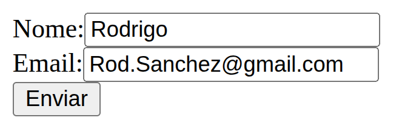
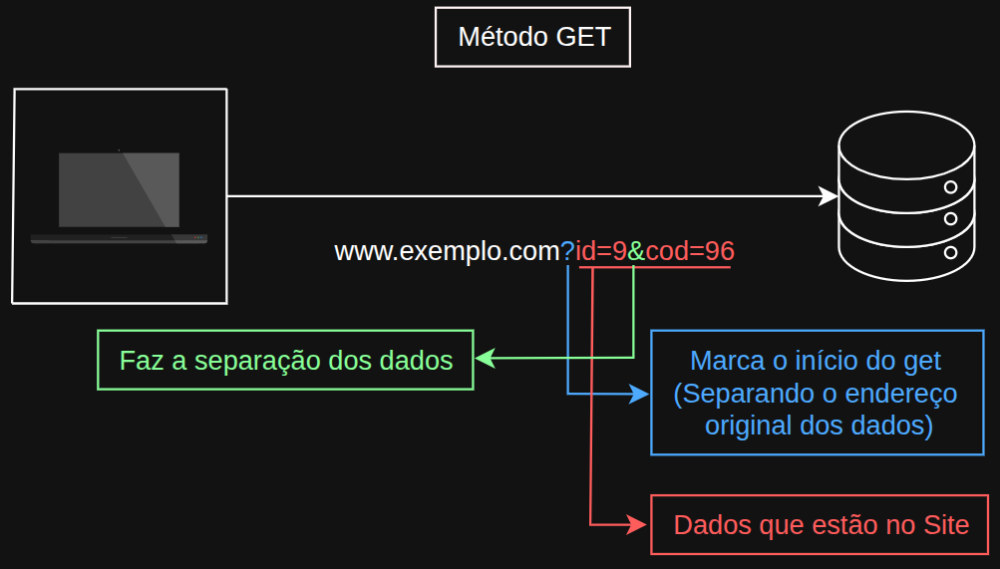
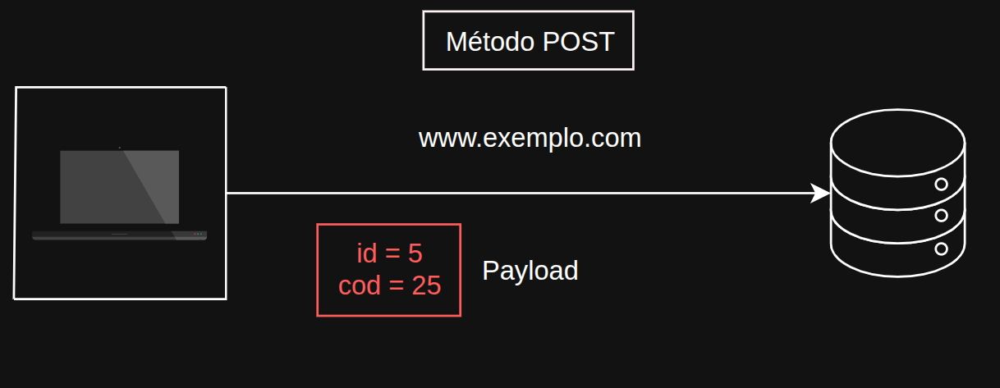
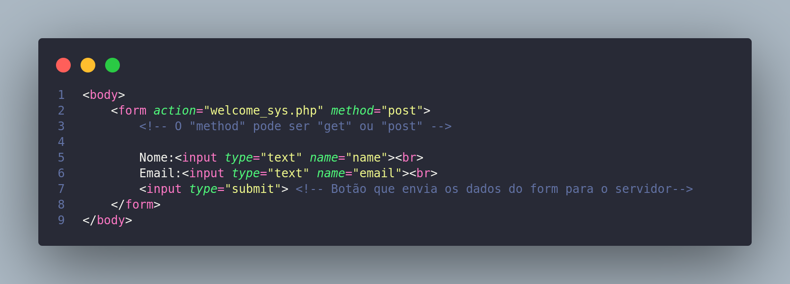
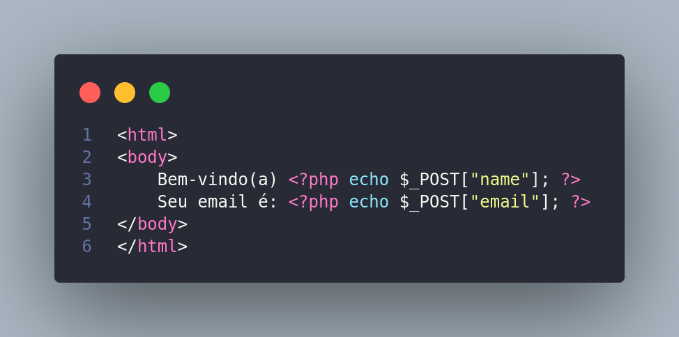

# 🌐 Demonstrando na prática a Arquitetura Cliente x Servidor

Neste exemplo, temos um site com um formulário com as seguintes características:

---

### 📝 Contextualização

---

**1-** O cliente acessa a página com o formulário e insere os dados de nome e e-mail.

**2-** Ao enviar, a requisição é enviada ao servidor que hospeda a aplicação.

**3-** O servidor processa a requisição e devolve a resposta.

**4-** A resposta contém os códigos que serão executados no navegador do cliente.

**5-** A página do cliente (da resposta) mostra uma mensagem de boas-vindas.

---

## 📤 Métodos de envio de dados

Vamos ver dois métodos de envio de dados:

### 🔎 Método GET
---

&rarr; No método GET, os dados são anexados ao endereço do site.

|Dados|
|:---:|
|id=9|
|cod=96|

---

### 📩 Método POST

---

&rarr; No método POST, os dados são enviados no corpo da mensagem.

&rarr; Portanto, o endereço não é alterado.

> **OBS:** É importante ficar atento ao método de envio. 

---

## 🏷️ Campo de formulário

&rarr; Cada campo de formulário tem um nome.

&rarr; É importante que o nome do campo tenha uma ligação clara com o conteúdo que ele representa.

&rarr; A aplicação do servidor extrai os conteúdos vindos da requisição.

&rarr; Os nomes dos campos devem ser os mesmos, tanto do lado do cliente quanto do lado do servidor.

---

## 🎨 Demonstração Front-end

---

### 💡 Explicando o código HTML

- A tag `<form>` define um formulário.
    - Nela, definimos dois parâmetros:
        - `action` &rarr; Indica o endereço para onde os dados serão enviados.
        - `method` &rarr; Indica o método de envio de dados.

- A tag `<input>` define um campo de formulário.
    - Nela, definimos dois parâmetros:
        - `type` &rarr; Indica o tipo de campo:
            - `text` &rarr; Campo de texto normal.
            - `submit` &rarr; Botão que envia os dados do formulário.
        - `name` &rarr; Indica o nome do campo (o mesmo que será utilizado no **Back-end**).

---

## 🖥️ Demonstração Back-end

---

### 💡 Explicação do código em PHP

> **OBS:** O PHP suporta as tags HTML.

- O `<?php?>` define um bloco de código em PHP.
    - `echo` &rarr; Exibe a informação na tela.
    - `$_POST` &rarr; Obtém os dados do formulário enviados pelo método **POST** (se o método de envio fosse **GET**, seria **$_GET**).
        - `["..."]` &rarr; Obtém o conteúdo de um campo do formulário com base no nome dele **(definido na tag `<input name="...">`)**.

--- 

## 📝 Resumo

- **Métodos de envio de dados**: GET & POST 
    - **GET** – Método de envio de dados que anexa os dados ao endereço do site.
    - **POST** – Método de envio de dados que envia os dados no corpo da mensagem.

- **Campo de formulário**: Os nomes dos campos devem ser os mesmos, tanto do lado do cliente quanto do lado do servidor.

---

> **Imagens feitas por mim, e o conteúdo abordado pode ser visto também em** [w3schools.com](https://www.w3schools.com/php/php_forms.asp)
