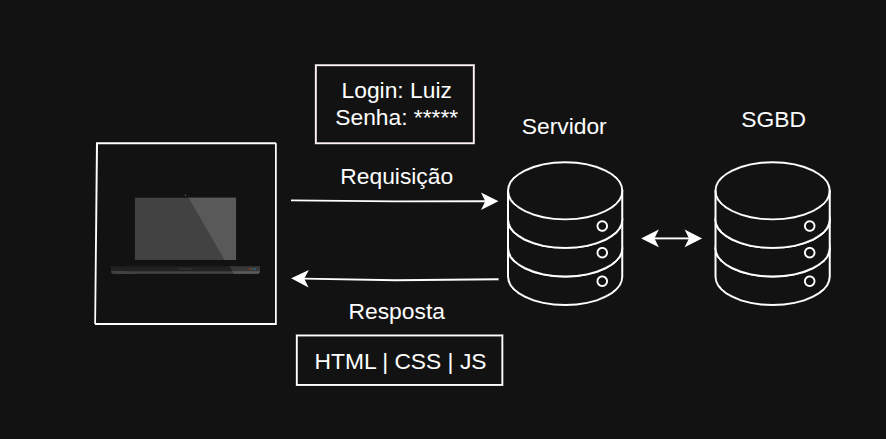

# 🌐 Páginas dinâmicas e acesso a dados

Antes de falar sobre as páginas dinâmicas, vamos ver sobre as páginas estáticas.

## 📄 Sobre Páginas Estáticas - Características

- A web surgiu no CERN (Organização Europeia para Pesquisa Nuclear) em 1990.
- Tratava-se de página estática.
- Todos que acessavam viam o mesmo conteúdo.
- O objetivo inicial foi a divulgação e o compartilhamento de dados científicos.
- Posteriormente, as empresas e instituições perceberam o potencial da web.

## ⚡ Sobre Páginas Dinâmicas - Características

- Houve demanda por conteúdo gerado dinamicamente.
- Bankline, redes sociais, plataformas de e-commerce, etc.
- Os usuários acessam as páginas, inserem login e senha e, depois, veem seus dados e seus conteúdos.

</img>